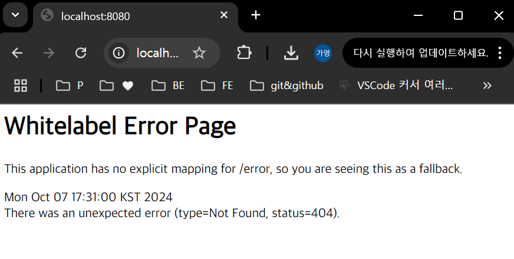

# 1주차 복습

## REST API

- HTTP uri를 통해 자원을 명시하고, HTTP 메서드 (GET : 조회, POST : 생성, PUT : 수정, DELETE : 삭제)를 통해 해당 자원에 대한 CRUD operation을 적용하는 것
- REST는 자원 기반의 구조 설계의 중심에 리소스가 있고, HTTP method를 통해 리소스를 처리하도록 설계된 아키텍처
- 웹의 모든 자원에 고유한 ID인 HTTP URI 를 부여

### RESTful APi를 만드는 이유

- client side의 플랫폼에 대해 고려하지 않고, 바로 객체로 치환이 가능한 형태의 데이터 통신을 지향하게 되면서 서버와 클라이언트의 역할을 분리

## REST의 구성

1. 자원 (resource) - URL
   - 모든 자원에 고유한 id가 존재. 이 자원은 서버에 존재
   - 자원을 구별하는 ID는 /orders/order_id/1 와 같은 HTTP URI
2. 행위 (verb) - HTTP method
   - GET, POST, PUT, DELETE와 같은 HTTP 메서드
3. 표현 (representations)
   - client가 자원의 상태(정보)에 대한 조작 요청 시, server는 이에 적절한 응답(representation)을 보냄
   - 대부분 JSON 형태로 representation을 나타내지만, 하나의 자원은 여러 형태로 표현이 가능하다

## REST의 특징

1. 클라이언트 / 서버 구조

   - REST 서버는 api를 제공하고 비즈니스 로직을 처리 및 저장

2. 무상태성 (stateless)

   - REST가 무상태성을 갖는 이유 : http의 특성을 이용하기 때문
   - 즉, 서버에서 어떤 작업을 하기 위해 상태 정보를 기억할 필요 X, 들어온 요청에 대한 처리만 해주면 됨
     -> 구현이 쉽고 단순해짐

3. 캐시 처리 가능 (cacheable)

   - REST는 http라는 기존 웹 표준을 사용하는 특징이 있기 때문에 기본 웹에서 사용하는 인프라를 그대로 사용 가능
   - 대량의 요청을 효율적으로 처리하기 위해 캐시가 요구됨
   - 캐시를 사용함으로써 응답 시간이 빨라지고, REST 서버 트랜잭션이 발생하지 않기 때문에 전체 응답시간, 성능, 서버의 자원 이용률을 향상시킬 수 있음

4. 자체 표현 구조 (self - descriptiveness)

   - JSON 메시지 포맷 이용 -> 직관적인 이해 가능 / REST api 메시지만으로 그 요청에 대한 행위를 알 수 있음

5. 계층화 (layered system)

   - 클라이언트 / 서버가 분리되어 있기 때문에 중간에 프록시 서버, 암호화 계층 등 중간 매체를 사용할 수 있어 자유도가 높음

6. 유니폼 인터페이스 (uniform interface; 인터페이스 일관성)
   - 인터페이스 일관성 : RESTful 서비스가 통신을 위해 사용하는 인터페이스가 일관된 방식으로 설계되어야 함을 의미 -> 클라이언트와 서버 간 상호작용 단순화 / 시스템 분리 가능 / 각 부분의 독립적인 개발 가능
   - 특정 언어나 기술에 종속되지 않음

  

# todomate API 명세서

1. 유저 관리 API

   - 회원가입 : POST /register
   - 로그인 : POST /login

2. 할 일 관리 API

   - 할 일 전체 조회 : GET `/todo`
   - 특정 친구의 할 일 조회 : GET `/todo/mate/{mate_id}`
   - 할 일 생성 : POST `/todo`
   - 할 일 수정 : PATCH `/todo/{todo_id}`
   - 할 일 삭제 : DELETE `/todo/{todo_id}`
   - 할 일 체크 : POST `/todo/{todo_id}/check`
   - 할 일 체크 해제 : POST `/todo/{todo_id}/uncheck`

3. 친구 관리 API
   - 친구 추가 : POST `/mate/add/{mate_id}`
   - 친구 조회 : GET `/mate`
   - 친구 삭제 : DELETE `/mate/delete/{mate_id}`

  

# 스프링 개발환경 세팅 사진

