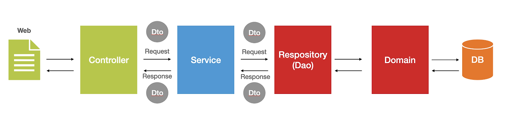
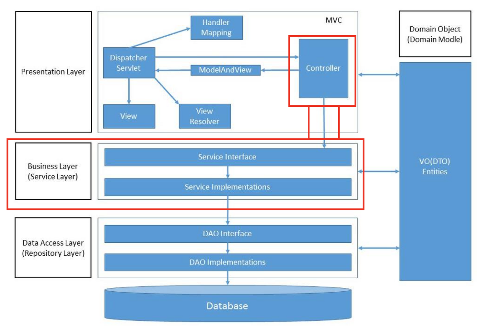

# 5주차 복습

## 서비스 계층

- `@Service` 가 사용되는 서비스 영역

- 어플리케이션의 비즈니스 로직을 수행
- 서비스 계층의 하나의 메서드에는 원자성을 갖는 로직을 기술
- 로직의 원자성을 보장하기 위해서 **서비스 계층에 메서드 단위로 트랜잭션을 적용**

  - 레포지토리 계층이 아닌 서비스 계층에 각각의 메서드 단위로 트랜잭션을 거는 것에 유의
  - `@Transactional`이 사용되어야 하는 영역

- 서비스 계층은 API 계층에서 구현한 Controller 클래스가 서비스 계층의 Service 클래스와 메서드 호출을 통해 상호작용함
- API 계층의 Controller 클래스의 핸들러 메서드와 Service 클래스의 메서드는 1대1로 매칭됨

### 스프링 계층간 흐름도

### DI를 통한 API 계층과의 연동

> 생성자 기반 의존성 주입을 할 경우, 주입되는 클래스 객체는 가급적 final 키워드를 사용할 것
> DI를 하려면 주입받는 대상, 주입될 대상 모두 스프링 빈으로 등록되어야 함

서비스 클래스를 스프링 빈으로 등록하려면 클래스에 `@Service` 어노테이션을 추가해야 함

## 스프링 계층

스프링의 계층은 Presentaition Layer, Business Layer, Data Access Layer ; 크게 3개로 나눌 수 있다

1. Presentationa Layer

- 브라우저상의 웹 클라이언트의 요청 및 응답을 처리
- 서비스 계층, 데이터 액세스 계층에서 발생하는 exception을 처리
- `@Controller` 어노테이션을 사용해 작성된 Controller 클래스가 이 계층에 속함

2. Business Layer (Service Layer)

- 어플리케이션 비즈니스 로직 처리와 비즈니스와 관련된 도메인 모델의 적합성을 검증
- 트랜잭션 관리
- 프레젠테이션 계층과 데이터 액세스 계층 사이를 연결하는 역할로, 두 계층이 직접적으로 통신하지 않도록 함
- Service 인터페이스와 `@Service` 어노테이션을 사용하여 작성된 Service 구현 클래스가 이 계층에 속함

3. Data Access Layer (Repository Layer)

- ORM을 주로 사용하는 계층
- DAO 인터페이스와 `@Repository` 어노테이션을 사용하여 작성된 DAO 구현 클래스가 이 계층에 속함
- 데이터베이스에 데이터를 CRUD하는 계층

4. Domain Object Layer (Domain Model Layer)

- DB의 테이블과 매칭될 클래스
- 엔티티 클래스라고도 부름
